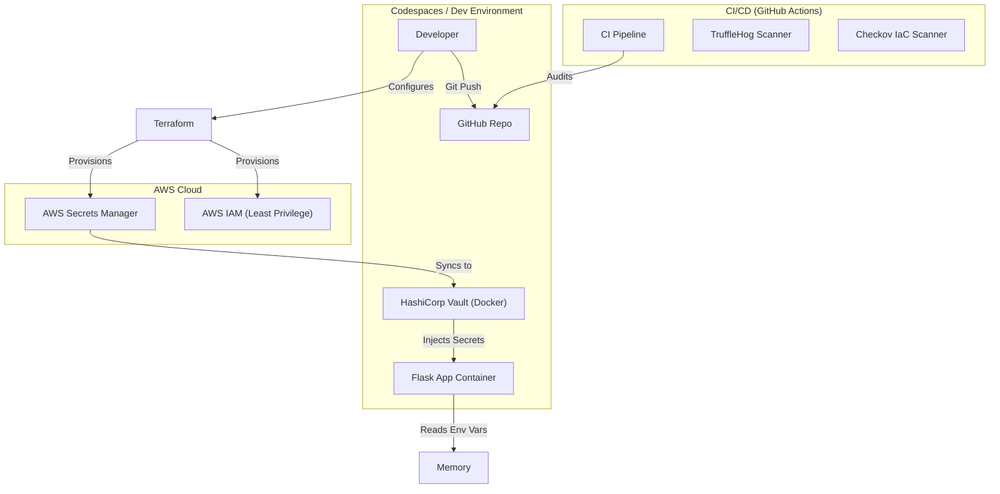

# Enterprise-Grade Secrets Management System

## Project Overview

This project implements a secure, zero-trust secrets management architecture designed for modern cloud-native enterprises. It leverages **HashiCorp Vault** as the central secrets engine and **AWS Secrets Manager** for cloud-native secret storage, ensuring that no sensitive data is ever hardcoded, committed to version control, or exposed in plain text.

### The Problem
Traditional secrets management often involves `.env` files, hardcoded strings, or insecure CI/CD variables. This leads to:
- **Secret Sprawl**: Secrets scattered across code, logs, and config files.
- **Lack of Rotation**: Static secrets that are rarely changed.
- **Poor Auditing**: No visibility into who accessed what secret and when.

### The Solution
A centralized, automated, and strictly governed system where:
1.  **Identity-Based Access**: Applications authenticate to retrieve secrets (no "sharing" of passwords).
2.  **Dynamic Injection**: Secrets are injected into the application process memory *only* at runtime.
3.  **Audit & Compliance**: All access is logged; secrets are scanned in CI/CD.

## Architecture



## Secrets Lifecycle

1.  **Creation**: Secret is created in AWS Secrets Manager (or Vault).
2.  **Storage**: Encrypted at rest using AWS KMS or Vault's barrier encryption.
3.  **Retrieval**:
    - Application starts.
    - `inject_secrets.sh` authenticates to Vault.
    - Secrets are fetched and exported as environment variables.
    - Application process is `exec`'d, inheriting the environment.
4.  **Rotation**: `rotate_secrets.sh` updates the secret in the store. Application restarts or re-fetches to apply.
5.  **Revocation**: Access is revoked via IAM or Vault Policy changes.

## Security Controls

-   **Least Privilege IAM**: The AWS IAM User has permission *only* to read specific secrets (`secretsmanager:GetSecretValue`) and decrypt with a specific KMS key.
-   **CI/CD Gates**:
    -   **TruffleHog**: Scans every commit for high-entropy strings and known secret patterns.
    -   **Checkov**: Scans Terraform code for misconfigurations (e.g., overly permissive policies).
-   **Ephemeral Injection**: Secrets exist in the application container *only* as environment variables, not on disk.

## Setup & Usage

### 0. Prerequisites (if running in a fresh Codespace)
If `terraform` or `jq` are missing, run:
```bash
chmod +x scripts/install_tools.sh
./scripts/install_tools.sh
```

### 1. Infrastructure Setup (AWS)
```bash
cd aws
terraform init
terraform apply
```

### 2. Vault Setup (Local)
```bash
cd vault
docker-compose up -d
# Wait for Vault to start
../scripts/vault_setup.sh
```

### 3. Application Run (Secure)
```bash
cd ..
# Run the app locally with secrets injected from Vault
export VAULT_ADDR='http://127.0.0.1:8200'
export VAULT_TOKEN='root' # In prod, use proper auth method
./scripts/inject_secrets.sh python3 app/app.py
```

### 4. Verify
Open the app URL. You should see a JSON success message.
No secrets will be displayed.

### 5. Rotate Secrets
```bash
./scripts/rotate_secrets.sh
# Restart app to pick up changes
```

## Testing & Verification
The CI/CD pipeline in `.github/workflows/ci.yml` automatically validates the security posture on every push.
```bash
# Manual check
trufflehog filesystem . --only-verified
checkov -d aws/
```
